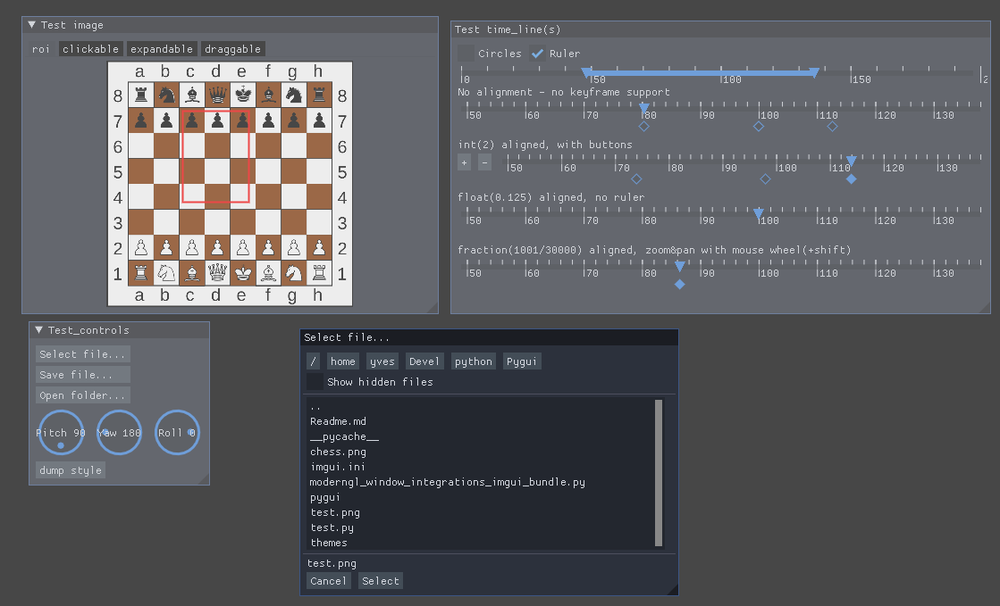

# PyGUI

## 1 - What?
A collections of imgui widgets and utilities written in python. Compatible with imgui-bundle and pyimgui. Widgets include:  
__Image related widgets__:  
+ pygui.image_expandable: an image that occupies all available space. One can constrain aspect ratio.
+ pygui.image_clickable: returns (x,y,w) tuple representing the relative position of mouse clicks occuring in an image (x,y in range[0.0,1.0], w=1,-1).
+ pygui.image_draggable: returns the amount of drag that has occured within an image since last time.
+ pygui.image_roi: enables the selection of rectangular region of interest (roi) on an image.
+ pygui.image_crop: enables the selection of crop region through 4 lines.
+ pygui.image_polygon: enables the selection of n pointspolygons.

__Controls__:
+ pygui.knob_float: a knob control that can loop over full circle. Usefull for angle inputs.  
+ pygui.ruler: draws a ruler in current window (from current position to right side of window).  
+ pygui.range_float2: enables the selection of a range.  
+ pygui.time_line: enables setting a position within a range and adding/removing/jumping to key positions. setting and destroying keyframes can be done with middle mouse button.
+ pygui.pan_and_zoom: utility func to interact with pygui.time_line.

__FileDialogs__:
+ pygui.popup_file_open_selector.
+ pygui.popup_file_save_as_selector.
+ pygui.popup_dir_open_selector.  

and their single button counter_parts
+ pygui.file_select_button.
+ pygui.file_save_as_button.
+ pygui.dir_select_button.

## 2 - Why ?
Most widgets do not have counterparts in imgui.bundle nore pyimgui. Imgui.bundle provides bindings for some related/replacement widgets and functions, but these were not available when I started the project(s)  
Most widgets do not have counterparts in imgui.bundle

## 3 - Howto ?
The test programm should be demonstrative enough! requires moderngl, moderngl-window and pyimgui or imgui-bundle.  
Because the library is single file, I do not provide a setup.py. Just the entire pygui folder to your project tree.  

## 4 - Notes !
At the time of writing, imgui-bundle-1.92 is not compatible with moderngl/moderngl-window. A patch has been submitted (the proposed patch file is integrated in the present repo). 

